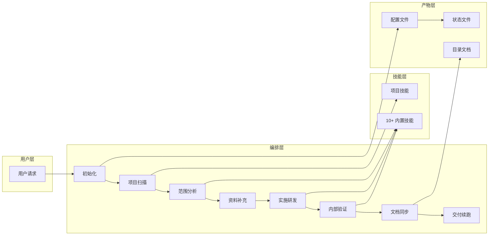
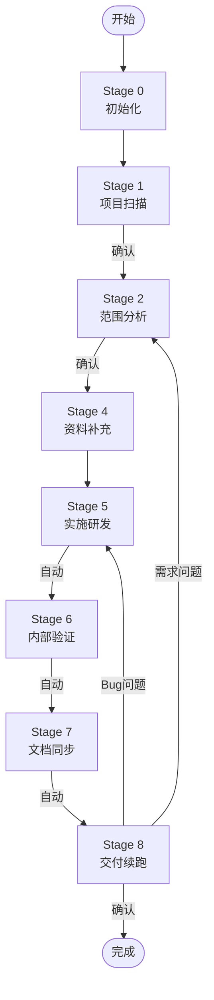

# frontend-workmate

> **让 AI 像资深工程师一样工作**

**前端研发全流程编排技能包** — 技能驱动的任务流程框架，规范化执行 Bug 修复、Feature 实现、Refactor 改造等前端研发任务。

## 为什么选择 frontend-workmate？

| 问题 | frontend-workmate 的解决方案 |
| --- | --- |
| AI 随意修改代码，缺乏约束 | 9 阶段流程强制门禁，每步必须形成产物 |
| Bug 修复治标不治本 | 系统化调试技能，先找根因再修复 |
| 缺乏项目上下文，反复追问 | 项目技能自动生成，一次扫描长期复用 |
| 修改后无验证，质量失控 | 自动衔接 Stage 5→6→7，强制验证闭环 |
| 反馈后不知道该回到哪一步 | 智能回退，根据反馈类型自动定位阶段 |

## 核心架构



## 快速开始

### 1. 安装

```bash
# 全局安装（推荐）
git clone https://github.com/your-org/frontend-workmate.git
mkdir -p ~/IDE配置目录/skills && cp -r frontend-workmate ~/IDE配置目录/skills/
# 例如：mkdir -p ~/.trae/skills 或 mkdir -p ~/.cursor/skills

# 或项目内安装
mkdir -p your-project/IDE配置目录/skills
cp -r frontend-workmate your-project/IDE配置目录/skills/
# 例如：mkdir -p your-project/.trae/skills 或 mkdir -p your-project/.cursor/skills
```

### 2. 初始化

```bash
cd your-project
node IDE配置目录/skills/frontend-workmate/scripts/init-skills.js --ide .trae
# 例如：node .trae/skills/frontend-workmate/scripts/init-skills.js --ide .trae
# 或：node .cursor/skills/frontend-workmate/scripts/init-skills.js --ide .cursor
```

### 3. 使用

在 AI IDE 中发起请求：

```
修复登录页面的表单验证问题
```

技能将自动执行完整流程，并在每个确认点等待你的反馈。

## 设计理念

### 三核心目录

配置文件仅存储 **3 个路径**，其他路径通过拼接：

```
project_work_dir    → 用户项目根目录（研发改动依据）
project_ide_dir     → 项目 IDE 配置目录（存放配置、技能、规则、状态）
static_config_dir   → 静态资源根目录（存放静态技能、静态规则）
```

**优势**：
- 全局安装和项目内安装使用同一套逻辑
- 配置精简，运行时动态计算
- 技能引用路径统一

### 研发循环（Stage 5→6→7→8）

核心设计：**Stage 5-7 自动衔接，Stage 8 等待用户确认**

```
实施研发 → [自动] → 内部验证 → [自动] → 文档同步 → [自动] → 交付续跑 → [等待确认]
```

**为什么这样设计？**
- 代码修改后必须立即验证，避免遗漏
- 文档同步紧随验证，确保产物一致性
- 交付确认作为唯一用户反馈入口，智能回退

### 智能回退

根据用户反馈内容自动判断回退阶段：

| 反馈类型 | 回退阶段 | 说明 |
| --- | --- | --- |
| "登录按钮点击没反应" | Stage 5 | Bug 问题 → 回到实施研发 |
| "这个需求要改一下" | Stage 2 | 需求问题 → 回到范围分析 |
| "进入步骤5" | 用户指定 | 明确指令 → 直接跳转 |

## 流程详解



| 阶段 | 关键动作 | 用户交互 |
| --- | --- | --- |
| Stage 0 | 初始化配置、生成任务 ID | 无 |
| Stage 1 | 扫描项目、生成 `fw-project-develop` | **等待确认** |
| Stage 2 | 分析任务类型、规划技能路线 | **等待确认** |
| Stage 3 | 长任务拆分（可选） | 无 |
| Stage 4 | 收集前置资料 | 等待用户提供 |
| Stage 5 | 执行代码修改、调用技能 | 无 |
| Stage 6 | lint/type/build/功能验证 | 无 |
| Stage 7 | 更新项目技能、生成目录文档 | 无 |
| Stage 8 | 输出交付结果 | **等待确认** |

## 内置技能列表

| 技能名 | 用途 | 调用时机 |
| --- | --- | --- |
| `fw-project-develop` | 项目技能（Stage 1 生成） | Stage 2/5/6 必须调用 |
| `fw-react-best-practices` | React 最佳实践 | React 技术栈研发时 |
| `fw-react-components` | React 组件规范 | 组件开发时 |
| `fw-systematic-debugging` | 系统化调试 | Bug 修复时 |
| `fw-typescript-advanced-types` | TypeScript 高级类型 | 复杂类型问题 |
| `fw-accessibility` | WCAG 可访问性 | 页面/组件改动验证时 |
| `fw-web-design-guidelines` | UI 规范 | 样式/UI 改动验证时 |
| `fw-code-analysis-doc` | 代码分析文档 | 目录关系分析时 |
| `fw-task-plan-checkpoint` | 长任务续跑 | 多步骤任务 |

## 9 阶段说明

### Stage 0: 初始化

- 执行 `init-skills.js` 初始化脚本
- 生成任务 ID
- 创建配置文件和状态文件

### Stage 1: 项目扫描

- 扫描项目结构、技术栈、构建方式
- 生成项目技能 `fw-project-develop`
- **等待用户确认**

### Stage 2: 范围分析

- 分析任务类型（bug/feature/refactor）
- 确定修改范围和风险点
- 规划技能调用路线
- **等待用户确认**

### Stage 3: 执行计划

- 判断是否需要长任务拆分
- 条件满足时跳过

### Stage 4: 资料补充

- 收集前置资料（接口文档、设计稿等）
- 等待用户提供或跳过

### Stage 5: 实施研发

- 执行代码修改
- 调用相关技能
- **自动进入 Stage 6**

### Stage 6: 内部验证

- 执行 lint/type/build/test
- 功能验证
- **自动进入 Stage 7**

### Stage 7: 文档同步

- 更新项目技能（如有新增长期知识）
- 生成目录说明文档
- **自动进入 Stage 8**

### Stage 8: 交付续跑

- 输出交付结果
- **等待用户确认**
- 根据反馈智能回退

## 智能回退规则

| 用户反馈类型 | 回退阶段 |
| --- | --- |
| Bug/实现问题 | Stage 5 → 自动执行 5→6→7→8 |
| 需求问题 | Stage 2 |
| 资料补充 | Stage 4 |
| 明确指定步骤 | 用户指定阶段 |

## 使用示例

### Bug 修复

```
用户: 修复登录页面的表单验证问题

技能: 
  [初始化] 任务ID: task_abc123
  [项目扫描] 生成 fw-project-develop
  [范围分析] 任务类型: bug，修改范围: src/pages/Login.tsx
  [实施研发] 调用 fw-systematic-debugging 找到根因
  [内部验证] 执行 lint/type/build，功能验证通过
  [文档同步] 无需更新项目技能
  [交付续跑] 已修复表单验证逻辑...
```

### Feature 实现

```
用户: 新增用户管理模块

技能:
  [初始化] 任务ID: task_def456
  [项目扫描] 已有 fw-project-develop
  [范围分析] 任务类型: feature，涉及: src/pages/User/
  [资料补充] 等待接口文档...
  [实施研发] 调用 fw-react-best-practices
  [内部验证] 功能验证通过
  [文档同步] 更新 src/pages/User/README.md
  [交付续跑] 用户管理模块已实现...
```

## 配置文件位置

配置文件 `.fw-session-config.json` 存放于 `{project_ide_dir}`：

```
your-project/IDE配置目录/.fw-session-config.json
# 例如：your-project/.trae/.fw-session-config.json
# 或：your-project/.cursor/.fw-session-config.json
```

## 开发与扩展

### 添加新技能

1. 创建技能目录：`skills/curated/your-skill/`
2. 创建 `SKILL.md` 文件（YAML frontmatter 必含 `name`、`description`）
3. 运行 `init-skills.js` 同步技能

### 自定义阶段

修改 `stages/*.md` 文件定义阶段行为。

### 自定义规则

修改 `rules/*.md` 文件定义流程规则。

## License

MIT

## 贡献指南

欢迎提交 Issue 和 Pull Request。

1. Fork 本仓库
2. 创建特性分支 (`git checkout -b feature/amazing-feature`)
3. 提交更改 (`git commit -m 'Add amazing feature'`)
4. 推送到分支 (`git push origin feature/amazing-feature`)
5. 创建 Pull Request
