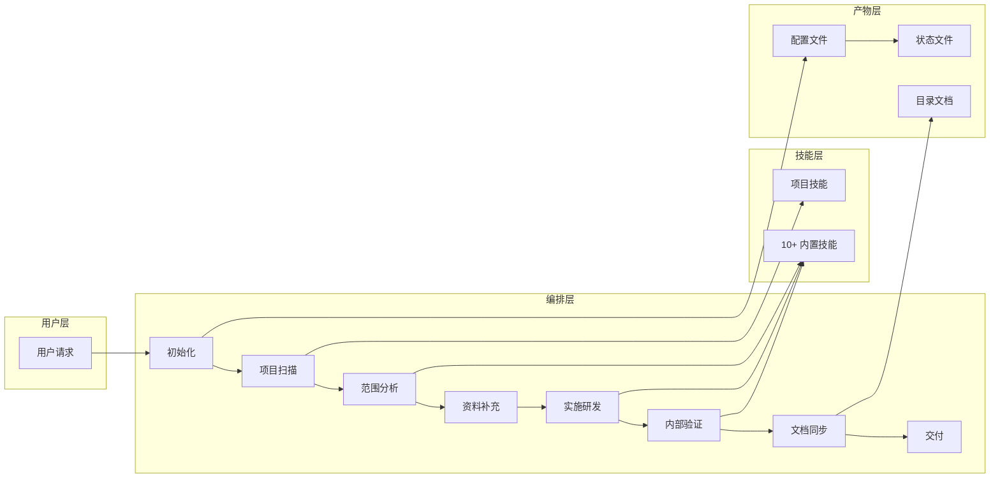
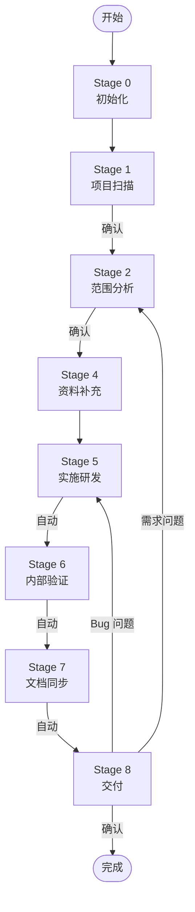

# frontend-workmate

> **让 AI 像资深工程师一样工作**
> 
> **告别"试试看"式编程，拥抱确定性交付**

**全栈前端研发编排技能包** — 基于技能驱动的任务工作流框架，标准化执行 Bug 修复、Feature 实现、重构等前端研发任务。

**[📖 查看英文版本 (Read English Version)](docs/README_EN.md)**

---

## 🌏 分支说明

> **提示**：如果您需要使用**英文版本**的技能包，请拉取 `main` 分支：
> ```bash
> git clone https://github.com/your-org/frontend-workmate.git
> # 当前为中文版本 zhCNMain 分支
> ```

---

## ✨ 它能为你带来什么？

### 🎯 **确定性输出**

不再是"写一段代码试试"，而是：

```
用户请求 → 系统化分析 → 精准定位 → 验证闭环 → 可追溯交付
```

每一份产出都有据可查、有迹可循。

### 🔥 **根治痛点**

| 你遭遇的困境 | frontend-workmate 如何根治 |
| --- | --- |
| 💥 **AI 改代码像"赌博"** — 改完不知道会不会炸 | ✅ **9 阶段强制门禁** — 每步必须产出可验证产物，漏一步都不行 |
| 💥 **Bug 修了一个又一个** — 今天改的明天又复现 | ✅ **根因驱动调试** — 不找到真正的病灶，绝不动刀修复 |
| 💥 **每次对话都要重新解释项目** — 像教新员工一样累 | ✅ **项目技能自动沉淀** — 一次扫描，长期记忆，再问无需重复 |
| 💥 **改完不验证直接交付** — 问题到上线才发现 | ✅ **Stage 5→6→7 自动闭环** — 代码写完自动验证、自动同步文档 |
| 💥 **说"改一下"AI 不知道改哪** — 反馈后迷失方向 | ✅ **智能回退定位** — 听懂你的意图，自动回到正确的阶段继续 |

### 🚀 **核心能力矩阵**

| 能力层级 | 内置技能 | 价值 |
| --- | --- | --- |
| **项目理解层** | `fw-project-develop` | 一次性扫描项目结构、技术栈、构建方式 → 形成长期可复用的项目记忆 |
| **调试方法论层** | `fw-systematic-debugging` | 不凭直觉改代码 → 先找根因，再精准修复，杜绝"治标不治本" |
| **最佳实践层** | `fw-react-best-practices` / `fw-react-components` | React 研发有章可循 → 40+ 规则约束，避免写出"能跑但有问题"的代码 |
| **质量保障层** | `fw-accessibility` / `fw-web-design-guidelines` | 改完页面自动体检 → 可访问性、UI 规范双重验证 |
| **复杂任务层** | `fw-task-plan-checkpoint` | 长任务不怕断 → 计划-执行-回写一体化，断点可随时续跑 |

### 💡 **一句话总结**

> **这不是一个"帮你写代码"的工具，这是一套"让 AI 懂规矩、守流程、负责任"的研发治理体系。**

## 核心架构



## 快速开始

### 1. 安装

```bash
# 全局安装（推荐）
git clone -b zhCNMain https://github.com/your-org/frontend-workmate.git
mkdir -p ~/ide-config-dir/skills && cp -r frontend-workmate ~/ide-config-dir/skills/
# 示例：mkdir -p ~/.trae/skills 或 mkdir -p ~/.cursor/skills

# 或项目内安装
mkdir -p your-project/ide-config-dir/skills
cp -r frontend-workmate your-project/ide-config-dir/skills/
# 示例：mkdir -p your-project/.trae/skills 或 mkdir -p your-project/.cursor/skills
```

### 2. 初始化

```bash
cd your-project
node ide-config-dir/skills/frontend-workmate/scripts/init-skills.js --ide .trae
# 示例：node .trae/skills/frontend-workmate/scripts/init-skills.js --ide .trae
# 或：node .cursor/skills/frontend-workmate/scripts/init-skills.js --ide .cursor
```

### 3. 使用

在 AI IDE 中发送请求：

```
修复登录页面的表单验证问题
```

技能会自动执行完整工作流，并在每个确认点等待您的反馈。

## 设计理念

### 三大核心目录

配置文件只存储 **3 个路径**，其他通过拼接获取：

```
project_work_dir    → 用户项目根目录（研发改动参考）
project_ide_dir     → 项目 IDE 配置目录（存储配置、技能、规则、状态）
static_config_dir   → 静态配置根目录（存储静态技能、静态规则）
```

**好处**：
- 全局安装和项目内安装使用相同逻辑
- 配置精简，运行时动态计算
- 技能引用路径统一

### 研发闭环（Stage 5→6→7→8）

核心设计：**Stage 5-7 自动串联，Stage 8 等待用户确认**

```
实施研发 → [自动] → 内部验证 → [自动] → 文档同步 → [自动] → 交付 → [等待确认]
```

**为什么这样设计？**
- 代码修改必须立即验证，避免遗漏
- 文档同步紧随验证，确保产物一致性
- 交付确认作为唯一用户反馈入口，智能回退

### 智能回退

根据用户反馈内容自动判定回退阶段：

| 反馈类型 | 回退阶段 | 说明 |
| --- | --- | --- |
| "登录按钮点击无响应" | Stage 5 | Bug 问题 → 回到实施研发 |
| "需要改这个需求" | Stage 2 | 需求问题 → 回到范围分析 |
| "去步骤 5" | 用户指定 | 明确指令 → 直接跳转 |

## 工作流详解



| 阶段 | 关键动作 | 用户交互 |
| --- | --- | --- |
| Stage 0 | 初始化配置，生成任务 ID | 无 |
| Stage 1 | 扫描项目，生成 `fw-project-develop` | **等待用户确认** |
| Stage 2 | 分析任务类型，规划技能路由 | **等待用户确认** |
| Stage 3 | 长任务拆解（可选） | 无 |
| Stage 4 | 收集前置资料 | 等待用户提供 |
| Stage 5 | 执行代码修改，调用技能 | 无 |
| Stage 6 | lint/type/build/功能验证 | 无 |
| Stage 7 | 更新项目技能，生成目录文档 | 无 |
| Stage 8 | 输出交付结果 | **等待用户确认** |

## 内置技能列表

| 技能名称 | 用途 | 调用时机 |
| --- | --- | --- |
| `fw-project-develop` | 项目技能（Stage 1 生成） | Stage 2/5/6 必须调用 |
| `fw-react-best-practices` | React 最佳实践 | React 技术栈研发 |
| `fw-react-components` | React 组件规范 | 组件开发 |
| `fw-systematic-debugging` | 系统化调试 | Bug 修复 |
| `fw-typescript-advanced-types` | TypeScript 高级类型 | 复杂类型问题 |
| `fw-accessibility` | WCAG 可访问性 | 页面/组件变更验证 |
| `fw-web-design-guidelines` | UI 规范 | 样式/UI 变更验证 |
| `fw-code-analysis-doc` | 代码分析与文档沉淀 | 目录关系分析 |
| `fw-task-plan-checkpoint` | 长任务断点续跑 | 多步骤任务 |

## 9 阶段说明

### Stage 0：初始化

- 执行 `init-skills.js` 初始化脚本
- 生成任务 ID
- 创建配置文件和状态文件

### Stage 1：项目扫描

- 扫描项目结构、技术栈、构建方式
- 生成项目技能 `fw-project-develop`
- **等待用户确认**

### Stage 2：范围分析

- 分析任务类型（bug/feature/refactor）
- 确定修改范围和风险点
- 规划技能调用路由
- **等待用户确认**

### Stage 3：执行计划

- 判断是否需要长任务拆解
- 满足条件时跳过

### Stage 4：资料补充

- 收集前置资料（API 文档、设计稿等）
- 等待用户提供或跳过

### Stage 5：实施研发

- 执行代码修改
- 调用相关技能
- **自动进入 Stage 6**

### Stage 6：内部验证

- 执行 lint/type/build/test
- 功能验证
- **自动进入 Stage 7**

### Stage 7：文档同步

- 更新项目技能（如有新增长期知识）
- 生成目录文档
- **自动进入 Stage 8**

### Stage 8：交付

- 输出交付结果
- **等待用户确认**
- 根据反馈智能回退

## 智能回退规则

| 用户反馈类型 | 回退阶段 |
| --- | --- |
| Bug/实施问题 | Stage 5 → 自动执行 5→6→7→8 |
| 需求问题 | Stage 2 |
| 资料补充 | Stage 4 |
| 明确指定步骤 | 用户指定阶段 |

## 使用示例

### Bug 修复

```
用户：修复登录页面的表单验证问题

技能：
  [初始化] 任务 ID：task_abc123
  [项目扫描] 已生成 fw-project-develop
  [范围分析] 任务类型：bug，修改范围：src/pages/Login.tsx
  [实施研发] 已调用 fw-systematic-debugging 寻找根因
  [内部验证] 已执行 lint/type/build，功能验证通过
  [文档同步] 无需更新项目技能
  [交付] 表单验证逻辑已修复...
```

### Feature 实现

```
用户：添加用户管理模块

技能：
  [初始化] 任务 ID：task_def456
  [项目扫描] fw-project-develop 已存在
  [范围分析] 任务类型：feature，涉及：src/pages/User/
  [资料补充] 等待 API 文档...
  [实施研发] 已调用 fw-react-best-practices
  [内部验证] 功能验证通过
  [文档同步] 已更新 src/pages/User/README.md
  [交付] 用户管理模块已实现...
```

## 配置文件位置

配置文件 `.fw-session-config.json` 存储在 `{project_ide_dir}`：

```
your-project/ide-config-dir/.fw-session-config.json
# 示例：your-project/.trae/.fw-session-config.json
# 或：your-project/.cursor/.fw-session-config.json
```

## 开发与扩展

### 新增技能

1. 创建技能目录：`skills/curated/your-skill/`
2. 创建 `SKILL.md` 文件（YAML frontmatter 必须包含 `name`、`description`）
3. 运行 `init-skills.js` 同步技能

### 自定义阶段

修改 `stages/*.md` 文件定义阶段行为。

### 自定义规则

修改 `rules/*.md` 文件定义流程规则。

## 许可证

MIT

## 贡献指南

欢迎提交 Issue 和 Pull Request。

1. Fork 本仓库
2. 创建特性分支 (`git checkout -b feature/amazing-feature`)
3. 提交更改 (`git commit -m 'Add amazing feature'`)
4. 推送到分支 (`git push origin feature/amazing-feature`)
5. 创建 Pull Request

---
