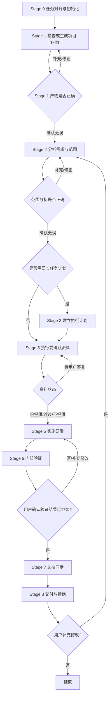

# 前端研发总编排技能

## 最短硬门禁

- 只要已进入本技能，必须把本文件视为最高优先级执行协议；不得自行改写流程。
- 只有当前步骤确实需要用户确认结论、补充资料或明确放行时，才允许通过 `继续`、`进入下一步`、`同意进入下一步` 这类答复切换阶段；其余步骤应按协议自然衔接，不因形式化确认额外停住。
- 只要用户回复中包含任何新需求、补充、修正、限制、路径、页面、文件、接口、样式、行为或实现方向信息，就必须停留当前阶段，先更新当前阶段产物。
- Stage 0 若执行了 `scripts/init-skills.js`，应继续完成初始化并直接衔接下一环节；不得因为形式确认停留在 Stage 0。
- Stage 2 只要“用户原始描述”“最初需求锚点”“截图/附件摘要”任一非空，就禁止再问“要做什么 / 功能目标是什么 / 这次要实现什么”。
- `frontend-workmate-project-skill` 只允许承载稳定项目知识与长期规则，不得写入当前单次任务的临时诉求、页面级实现偏好或一次性改造方案。

## 严格调试模式

- 当前文件用于调试阶段流程，默认按最严格模式执行。
- 严格模式下，必须先看 `总流程` Mermaid 图，再看各 Stage 说明；若两者冲突，以 `总流程` 为准。
- 严格模式下，只在协议明确要求用户确认、补充或选择时停住；不再默认每个 Stage 完成后都等待 `继续`。
- 只要用户回复中包含新的需求、修正、补充、限制、路径、页面、路由、接口、校验、样式、文案、行为等任何新信息，就一律视为“留在当前步骤继续收敛”，不得进入下一步。
- 若用户否定当前步骤结果，则按该步骤定义的回退目标回退；`Stage 0` 为唯一例外，只允许停留当前步骤。
- 严格模式下，禁止“我先扫一下再开始做”“我先直接改代码”“我先帮你聚焦需求后继续”这类跨步骤自推进表述。

## 定位

- 本文件用于定义前端研发任务的主编排协议。
- 目标不是重复解释背景，而是明确每一步该做什么、何时回退、何时复用已有项目技能、何时生成新的项目技能。
- 当用户要求分析项目、修复问题、实现 feature、执行 refactor、继续某个中断任务时，优先遵循本文件。

## 总流程

## 全局规则

- 把本技能视为“执行协议”，不是“说明清单”。
- `总流程` 中的 Stage 切换图是当前调试模式下的最高优先级协议；若正文其他规则与 `总流程` 冲突，以 `总流程` 为准。
- 项目内模板、脚本与阶段技能引用优先使用相对路径。
- 公共技能调用优先直接使用技能名，不再强依赖仓库内目录路径。
- 公共能力统一按技能包复用；Stage 1 产出的标准项目技能名称固定为 `frontend-workmate-project-skill`，后续阶段直接按该技能名引用。
- 需要结构化产物时，优先以 `templates/` 中的模板为契约。
- 任何可选逻辑都先判断是否存在；不存在时写 `not_applicable`。
- 不要默认每次都做全量仓库扫描；先判断当前项目是否已有可复用的项目技能。
- 在 Stage 1、Stage 2 未完成前，不进入正式研发；Stage 5 的执行前资料确认未完成时，也不得进入正式实现。
- 多步骤、长链路、跨目录、跨子项目、需要多轮验证的任务，默认启用长任务续跑。
- 若用户在中途补充、修正、否定结论，必须按回路退回对应 Stage，而不是带着旧结论继续执行。
- 必须始终保留“最初需求锚点”。Stage 1 到 Stage 8 的所有补充、调优、限制、实现偏好、技术约束，都只是在服务最初需求，不能把这些中间约束改写成新的主需求。
- 必须严格区分三类信息：`最初需求`、`阶段内补充约束`、`项目长期规则`。三者可关联，但不得互相覆盖。
- 若用户在某个阶段补充的是“实现约束 / 技术偏好 / 局部调整”，必须记录为该阶段的补充约束，而不是改写 `最初需求`。
- `frontend-workmate-project-skill` 只承载稳定的项目知识与长期规则，不得写入当前单次任务的临时诉求、页面级实现偏好或一次性的改造方案。
- 仅在当前 Stage 明确要求“用户确认 / 用户选择 / 用户补充资料”时，才暂停等待用户答复；其余阶段按协议自动衔接。
- “继续”必须是纯放行语句；若同一条回复中混入任何新信息、修正、限制或新诉求，则该回复不算放行，必须按“留在当前步骤继续收敛”处理。
- 若用户在当前阶段的确认点补充、修正、扩展诉求，不得把该回复误判成“同意进入下一步”；必须停留在当前阶段，先合并诉求、更新当前阶段产物，再向用户回显更新后的结论。
- 若项目不存在某项能力，不得为了补全流程而虚构路由、权限、接口、状态管理或构建规则。
- 若用户提供项目 skills、项目文档、UI 框架文档或 UI 框架 skills，优先吸收用户输入，再决定是否继续内部扫描与生成。
- 凡是流程中明确要求“由用户提供”的信息，必须先向用户询问并等待明确答复；禁止 AI 自行假设技术栈、版本、UI 框架、是否初始化、是否提供文档或是否提供 skills。
- 若某一步依赖用户输入但用户尚未明确回答，停留在当前 Stage，不得伪造输入继续执行。
- 一旦识别出“当前步骤需要用户输入 / 确认 / 选择 / 授权 / 纠偏”，必须在当次回复中向用户发起对应提问，或明确说明当前需要补充的内容，并在该次回复结束后等待用户输入；不得在同一回复中继续后续分析、技能调用、文件修改、初始化、命令执行或方案落地。
- 终端命令批准、工具 approval、shell confirm、命令执行许可，不得视为业务语义上的用户答复；只有用户在对话中明确表达，才可把字段从 `pending` 改为其他状态。
- 新会话首轮默认只允许执行一个阶段的一个阻塞动作；不得在同一条首轮回复里同时追问 Stage 0、Stage 1、Stage 2 的问题。
- 若 Stage 1 项目基线尚未确认，则首轮唯一允许主动发问的问题就是 Stage 1 项目基线问题；Stage 0 只能被动整理用户已说出的目标，不得顺手追问页面细节、交互细节、数据来源、还原标准或其他 Stage 2 问题。
- 默认不是“每个 Stage 都确认”；只有当前结论需要用户确认、正式研发前仍缺少必要资料，或验证结果需要用户明确放行时才停住；其余步骤默认自动衔接。

### 阶段状态标记

- 流程执行必须显式维护阶段状态，而不是只靠自然语言理解当前走到哪一步。
- 至少维护以下字段：
  - `current_stage`：`stage0_alignment | stage1_project_scan | stage2_scope | stage3_plan | stage4_inputs | stage5_implementation | stage6_verification | stage7_docs | stage8_delivery`
  - `current_stage_status`：`pending | in_progress | waiting_user | completed | blocked`
  - `next_stage`：下一目标阶段
  - `stage_block_reason`：当前不能推进的原因
- 只有当 `current_stage_status = completed`，且下一阶段进入条件满足时，才允许切换到 `next_stage`。
- 若 `current_stage_status = waiting_user` 或 `blocked`，必须停留在当前阶段，不得自行推进。
- 每次阶段切换前，先更新阶段状态；阶段切换后，再执行下一阶段动作。
- 若当前 Stage 被协议标记为自动衔接阶段，则 `current_stage_status = completed` 后即可进入 `next_stage`；仅显式确认点仍要求用户放行。

### 阶段最小产物

- 每个 Stage 都必须留下一个最小过站产物，不允许“内部想完就直接跳下一阶段”。
- 最小过站产物至少包含：
  - `current_stage`
  - `current_stage_status`
  - `stage_goal`
  - `entry_conditions`
  - `completion_conditions`
  - `next_stage`
  - `stage_block_reason`
- 阶段产物默认写入模板、任务文件或内部状态，不应原样展示给用户；但不能完全省略。
- 若当前阶段没有形成最小过站产物，则视为该阶段未完成，不得切换到下一阶段。

### 用户输入状态与门禁判定

- 对“由用户提供”的输入统一使用以下状态：`provided`（已提供）、`not_provided`（明确不提供）、`skipped`（明确跳过）、`pending`（待确认）、`not_applicable`（不适用）。
- 阻塞条件只取决于“是否有明确答复”，而不是“是否提供了资料本身”。
- 仅 `pending` 视为硬阻塞，必须停留当前 Stage。
- `provided`、`not_provided`、`skipped`、`not_applicable` 都视为“已完成答复”，可按当前 Stage 规则继续。
- 仅当用户已明确选择某条分支后，才要求该分支下的必填项完整。例如：只有在“初始化=是”时，才必须补齐初始化技术栈与版本。
- 是否阻塞只取决于当前 Stage 是否存在待补用户输入、待确认结论或待选择分支；不是默认每个 Stage 都停住。

### 用户提问类型与等待规则

- 在进入提问前，先判断当前缺失的是哪类用户提问或用户输入，而不是统一使用“请提供”。
- `provide`：用户需要补充资料或参数。提示语使用“请提供 xxx”；若资料可选，可追加“你可以直接回复提供的内容，我将优先采用您提供的资料生成或补齐对应技能；如果你不提供，也可以直接回复不提供/跳过，我再按当前流程继续”。
- `confirm`：用户需要确认当前结论是否正确。提示语使用“请确认 xxx”；并明确“如果没问题，可回复继续/没问题；如果有偏差，请直接补充或指出要修改的地方”。
- `choose`：用户需要在多个分支中做选择。默认使用普通文本直问；候选项可以用数字、字母或短标签列出，例如“1/2/3”、“A/B/C”或“方案甲/乙/丙”。必须同时告诉用户：既可以回复对应标记，也可以直接输入自己的想法或选择结果。除非宿主环境强制要求，否则不要优先使用可点击选项式交互。
- `approve`：用户需要接受风险或授权阶段推进。提示语使用“若你接受，请回复继续”；若不接受，则说明需要先补哪些信息。
- `correct`：用户需要纠正 AI 当前理解。提示语使用“如果有问题，请直接指出，我会先修正再继续”。
- 当用户回复内容同时包含“修正/补充诉求”和“可能的继续意图”时，优先按 `correct` 处理，而不是按“进入下一步”处理。
- 在判断提问类型后，还必须判断提问方式：
  - `text_reply`：适用于用户需要提供文档、skills、文件路径、目录路径、截图说明、接口信息、组件约束、设计说明等内容型输入。此类问题必须使用普通文本回复引导，不应使用选择器式交互。
  - `choice_ui`：仅作为极少数补充手段，且只适用于有限、清晰、互斥的选项；默认仍应优先用文本列项，让用户回复数字、字母、短标签，或直接描述自己的想法。
- 若用户需要去编辑器中引用文件、粘贴路径、补充文档、说明技能来源或描述约束，必须使用 `text_reply`，并直接告诉用户“你可以提供什么”；发问后结束当前回合即可。
- 不得把“是否提供文档/skills”这类开放式资料问题实现成单选框或多选框；因为该类场景的真实动作是用户补充内容，而不是在固定选项中做选择。
- 对“初始化方案”“是否继续当前分支”这类选择题，也优先使用普通文本直问，例如“你可以回复 1/2/3、A/B/C，或直接告诉我你的选择/想法”，而不是默认弹出选项。
- 任何提问一旦发出，当回合必须停止在该问题上，不得再继续推进下游步骤。
- 若用户对当前阶段补充了新诉求、边界、约束或更正信息，必须留在当前阶段合并这些内容；不能因为当前消息里出现了“可以”“继续”之类词语，就直接切到下一阶段。
- 当前阶段的收束提示语必须根据用户回复类型动态生成，不得固定写成同一句：
  - 若用户回复类型为 `provided`：可使用“我已接收并吸收你提供的资料”或“我已把你提供的内容合并进当前结论/技能”
  - 若用户回复类型为 `correct` 或补充约束：可使用“我已合并你刚补充的诉求”或“我已根据你的修正更新当前结论”
  - 若用户回复类型为 `not_provided` / `skipped`：可使用“我已记录你暂不提供该资料，我将按当前仓库证据继续”或“我已记录你跳过该项资料”
  - 若用户回复类型仅为 `confirm`：可使用“我已记录你的确认”或直接进入下一步确认提示，不要伪装成“已合并资料”
- 仅在当前步骤确实需要用户确认或提供资料时，才在结尾保留“如果没问题，你可以回复继续；如果还要补充或修改，也可以直接告诉我”
- 所有需要用户确认的步骤，用户侧输出默认采用“简短摘要 + 确认/补充提示”，不展示 `current_stage`、`current_stage_status`、`entry_conditions`、`completion_conditions`、`stage_block_reason` 等内部字段。
- 确认提示语不能只写“回复继续”；必须同时告诉用户：
  - 可以确认无误后继续
  - 也可以直接补充或修改当前结论
  - 若需要回退或调整，会先停留当前步骤处理
- 若一个阶段同时存在多个同类待答项，可合并成一轮提问；但只能收敛当前阶段所必需的问题，不得顺手追加后续阶段问题。
- 若当前阶段按协议属于自动衔接阶段，且不存在待补输入或失败项，应直接进入下一阶段，不再额外询问。
- 若问题属于可跳过输入，必须显式告诉用户可回复 `继续`、`跳过`、`不提供` 等；若问题属于硬门禁，则不得给出“我先按默认方案继续”的选项。
- Stage 0 / Stage 1 首轮提问必须遵循“按歧义最小化”原则：
  - 若已识别到唯一现有前端项目，则直接锁定该项目进入 Stage 1，不先追问“是否基于现有项目继续”
  - 若识别到多个前端项目，才向用户询问本次要基于哪个项目继续
  - 若未识别到前端项目，才询问是否需要初始化前端项目
  - 首轮不得同时索要项目 skills、项目文档、UI 资料、技术栈、版本、UI 库等整包信息

### 确认点统一处理

- 只有显式确认点才需要遵循统一确认处理模式，而不是所有阶段都强制停住。
- 用户回复 `继续 / 进入下一步 / 同意 / 没问题`：
  - 视为允许切到 `next_stage`
- 用户回复补充、修正、扩展诉求：
  - 视为当前步骤内继续收敛
  - 不得切到 `next_stage`
  - 必须先合并诉求并回显最新结论
- 用户回复否定、认为结果不行、要求修改：
  - 视为按当前步骤定义的回退目标处理
- 除 `Stage 0` 外，每个确认点都必须定义“停留当前步骤”和“否定时回退目标”。

#### 各阶段确认点规则

- `Stage 0`
  - 默认行为：自动完成初始化并进入下一环节
  - 用户补充诉求：留在 `Stage 0` 合并
  - 用户否定：仍留在 `Stage 0`
  - 说明：仅在工作区或任务类型无法判定时才发出一个最小澄清问题
- `Stage 1`
  - 用户补充项目信息或修正理解：留在 `Stage 1`，刷新 `frontend-workmate-project-skill`
  - 用户否定当前项目结论：留在 `Stage 1`
  - 说明：本阶段是显式确认点，需要用户确认项目技能产物是否正确
- `Stage 2`
  - 用户补充范围、路由、行为、边界：留在 `Stage 2`
  - 用户否定范围结论：留在 `Stage 2`
  - 说明：本阶段是显式确认点；只展示分析结论并让用户确认是否正确
- `Stage 3`
  - 用户补充计划、拆分、优先级：留在 `Stage 3`
  - 用户否定当前计划：留在 `Stage 3`
  - 说明：默认自动衔接到 `Stage 5` 的执行前资料确认，不单独作为等待点
- `Stage 5`
  - 用户补充实现要求或修改方向：留在 `Stage 5`
  - 用户否定当前实现结果：留在 `Stage 5`
  - 说明：本阶段开始前先收集接口/设计/联调等资料；用户一旦明确“提供 / 不提供 / 跳过”，就继续本阶段正式实现；实现完成后自动进入 `Stage 6`
- `Stage 6`
  - 用户补充验证要求：留在 `Stage 6`
  - 用户认为结果不行或要求修改：回退到 `Stage 5`
  - 说明：本阶段是显式确认点；输出验证结果后等待用户确认，确认后进入 `Stage 7`
- `Stage 7`
  - 用户补充文档要求：留在 `Stage 7`
  - 用户否定当前文档同步结果：默认回退到 `Stage 6`，若涉及实现问题则回退到 `Stage 5`
  - 说明：文档同步完成后自动进入 `Stage 8`
- `Stage 8`
  - 用户补充新需求、扩展需求、交付后修改：回退到 `Stage 2`
  - 用户仅补充交付说明：留在 `Stage 8`

### 技术栈分层定义

- `底层框架`：指构建/脚手架/工程底座，例如 `Vite`、`Webpack`、`Rspack`、`CRA`。
- `语言框架`：指应用框架，例如 `React`、`Vue`、`Angular`、`Svelte`。
- `语言`：指源码语言，例如 `TypeScript`、`JavaScript`。
- `UI 库`：指组件库或设计系统，例如 `Ant Design`、`Element Plus`、`Arco Design`、`Naive UI`。
- 若需要给用户推荐初始化方案，应按“底层框架 + 语言框架 + 语言 + UI 库”的结构给出，而不是只说“React 项目”或“Vite 项目”。
- 若用户已经给出 UI 库名称，则默认视为依赖名已知；若未给版本，默认按最新版处理。
- 在依赖真正安装或校验失败前，不要预先追问 UI 库的安装地址、本地路径、私仓来源或替代包名。
- 只有在后续初始化依赖、安装依赖、导入验证或构建校验时，确认“库名/版本/来源”确实无法解析，才回头请用户修正来源、路径或包信息。

## 技能调用矩阵

| 场景 | 必须/优先调用的技能 | 调用时机 |
| --- | --- | --- |
| 项目技能缺失或失效 | `project-scan-profile` | Stage 1 |
| 范围分析 | `frontend-change-scope` | Stage 2 |
| 目标目录缺少说明文档，或实现关系不清晰 | `code-analysis-doc` | Stage 2、Stage 7 |
| 多步骤、长链路、可能中断 | `task-plan-checkpoint` | Stage 3 |
| bug 修复 | `systematic-debugging` | Stage 5 |
| 复杂 TypeScript 类型问题 | `typescript-advanced-types` | Stage 5 |
| React feature 实现或性能优化 | `react-best-practices` | Stage 5 |
| React 组件拆分、组件生成、组件规范对齐 | `react-components` | Stage 5 |
| 通用研发执行 | `frontend-implementation` | Stage 5 |
| 内部验证 | `frontend-verification` | Stage 6 |
| 可访问性相关任务或验证需要 | `accessibility` | Stage 6 |
| UI 规范、Web 界面设计检查 | `web-design-guidelines` | Stage 6 |
| 文档同步 | `directory-doc-sync` | Stage 7 |
| 发现缺少关键可复用技能 | `find-skills` | 任意阶段 |

## 阶段候选技能表

| 阶段 | 先检查的技能来源 | 默认候选技能 | 典型触发条件 |
| --- | --- | --- | --- |
| `Stage 0` | 用户当前消息、已提供资料、项目技能索引 | `find-skills` | 当前任务需要的关键技能明显缺失时 |
| `Stage 1` | 用户提供项目 skills / 项目文档、项目内 UI skill、公共技能包 | `project-scan-profile`、`find-skills` | 项目 skills 缺失、失效、命名混乱，或扫描能力不足时 |
| `Stage 2` | `frontend-workmate-project-skill`、用户补充资料、公共技能包 | `frontend-change-scope`、`code-analysis-doc`、`find-skills` | 需要范围分析、目录关系提炼、补齐缺少技能时 |
| `Stage 3` | Stage 2 技能路线、长任务记录、公共技能目录 | `task-plan-checkpoint` | 长链路、多步骤、可能中断或需断点续跑时 |
| `Stage 5` 执行前资料确认 | `frontend-workmate-project-skill`、Stage 2 技能路线、用户提供资料、项目专项 skill | `find-skills` | 缺少前置资料、缺少框架/UI 规则支撑时 |
| `Stage 5` | `frontend-workmate-project-skill`、Stage 2 技能路线、公共技能包 | `frontend-implementation`、`systematic-debugging`、`react-best-practices`、`react-components`、`typescript-advanced-types`、`find-skills` | bug 修复、React 实现、复杂类型、缺依赖或缺少专项技能时 |
| `Stage 6` | Stage 5 产物、已调用技能记录、公共技能包 | `frontend-verification`、`accessibility`、`web-design-guidelines` | 内部验证、可访问性检查、UI 规范检查时 |
| `Stage 7` | 目录文档、实现产物、`frontend-workmate-project-skill`、公共技能包 | `directory-doc-sync`、`code-analysis-doc` | 需要同步目录文档、提炼稳定用法、补齐引用关系时 |
| `Stage 8` | 交付文档、任务记录、`frontend-workmate-project-skill`、公共技能目录 | `task-plan-checkpoint`、`find-skills` | 续跑、交接、发现交付阶段仍缺技能或上下文时 |

## 技能调用优先级

1. 每个阶段正式执行前，都必须先扫描当前可用技能来源，而不是执行到一半才临时决定是否调用技能。
2. 技能来源优先级固定为：
   - 用户当前会话明确提供的 skills / 文档 / 约束
   - 当前项目已命中的项目技能产物；当前默认使用 `frontend-workmate-project-skill`
   - 项目内已归档的 UI 框架 skill / 专项 skill
   - 其他可复用公共技能包
3. 先服从当前项目技能中的项目约束。
4. 再服从 Stage 2 已确认的任务范围与技能路线。
5. 若任务类型是 `bug`，优先进入 `systematic-debugging`，而不是直接写修复代码。
6. 若任务类型是 `feature` 或 `refactor`，先进入 `frontend-implementation`，再按技术栈补充 React、类型等辅助技能。
7. 若多个辅助技能同时可用，按“阻塞主路径优先、项目特定优先于通用、分析验证优先于美化优化”排序。
8. 若技能之间存在冲突，以项目技能和当前任务范围结论为准。
9. 若某阶段尚未完成“技能扫描与选型”，则该阶段不能算正式开始执行。

## 各阶段技能扫描

- `Stage 1`
  - 先检查用户提供的项目 skills / 项目文档 / UI 框架资料
  - 再检查是否已有可复用的项目技能产物
  - 再检查是否有可辅助扫描、文档提炼或能力补齐的公共技能包
- `Stage 2`
  - 先读取 `frontend-workmate-project-skill`
  - 再扫描适合分析当前任务的公共技能包，例如 `code-analysis-doc`、`find-skills`
  - 本阶段必须输出技能路线，供后续阶段强制执行
- `Stage 3`
  - 先检查是否需要 `task-plan-checkpoint`
  - 若计划依赖专项技能，也要把这些技能写进执行计划，而不是只在脑内保留
- `Stage 5`
  - 正式实现前先检查 `frontend-workmate-project-skill`、Stage 2 技能路线、用户提供资料中是否已包含研发前置约束
  - 若涉及设计、文档、权限或 UI 库规则，也要先检查是否已有对应 skills 可复用
  - 必须先读取 `frontend-workmate-project-skill`
  - 必须按 Stage 2 技能路线扫描并调用所需公共技能
- `Stage 6`
  - 必须先检查 Stage 5 是否已调用完必要技能
  - 再扫描适合验证的公共技能包，如 `accessibility`、`web-design-guidelines`
- `Stage 7`
  - 先检查是否需要 `code-analysis-doc` 或其他文档沉淀类技能
- `Stage 8`
  - 先检查项目技能、交付文档、长任务记录中是否已有可复用交付上下文

## 项目技能命名与发现

- Stage 1 产出的标准项目技能名称固定为 `frontend-workmate-project-skill`。
- 后续阶段默认直接按 `frontend-workmate-project-skill` 这个技能名引用，不再写目录。
- Stage 1 应优先检查 `frontend-workmate-project-skill` 是否已存在且可复用。
- Stage 1 发现项目技能时，按以下顺序查找：
  1. 当前工作区中已存在的项目技能候选，包括历史项目技能候选与当前已生成的项目技能产物；优先按固定技能名查找
  2. 从候选中选择与当前项目结构、技术栈、研发约束最匹配的技能直接复用
  3. 若仍找不到可复用候选，进入项目扫描，并生成标准项目技能产物 `frontend-workmate-project-skill`
- 若仓库包含多个前端子项目，应为每个子项目分别创建独立的项目技能，而不是混写到同一个文件。
- 若只找到历史项目技能但命名不规范，可先直接复用；仅在需要刷新、归档或标准化时，再归一到当前命名规范。

## 长期产物

| 阶段 | 长期保留的产物 | 默认位置 |
| --- | --- | --- |
| Stage 1 | 当前项目固定技能名对应的项目技能 | 默认以 `frontend-workmate-project-skill` 作为长期复用产物，引用时优先直接使用技能名 |
| Stage 7 | 目录级说明文档 | 目标目录内 README 或单一说明文档 |

## 临时产物

- Stage 3 的长任务记录只在任务较长、需要续跑时创建，默认放在 `skills/runtime/task-runs/<task-id>/`。
- Stage 8 的 `delivery-summary` 只在需要续跑、交接或明确留痕时写入，不视为长期知识。
- Stage 2、Stage 5、Stage 6 的阶段结论默认只服务当前回合，不要求长期保留。

## Stage 0：任务对齐

### 目标

- 完成环境初始化、文件接收、基础状态初始化，并判断是否可以进入 `Stage 1`。

### 输入

- 用户原始诉求
- 当前上下文中的限制条件
- 用户附带的截图、设计图、报错信息或路径线索（若有）

### 执行动作

1. 接收用户原始诉求、截图、附件、路径线索，并建立本轮任务上下文。
2. 若仓库中存在 `scripts/init-skills.js`，则在 Stage 0 必须先主动执行该脚本，再继续任何后续初始化动作；若本轮未实际执行，则 Stage 0 不得视为完成。脚本用于把 `skills/curated`、`skills/external` 下的技能整理成可直接调用的公共技能包；若源目录已不存在或目标技能已存在且非空，则记录为跳过，不视为阻塞。
3. 若本轮执行了 `init-skills.js`，用户侧提示语应收敛为“正在初始化...”与“初始化已完成，进入下一环节。”这类简短正文；不得要求用户额外回复 `继续` 才能进入后续阶段。
4. 初始化当前流程状态：记录当前阶段、目标仓库/工作区是否可识别、是否属于前端任务、是否具备进入 `Stage 1` 的最低条件。
5. 在本阶段建立“最初需求锚点”，只记录用户最初要解决的问题、目标页面/模块、期望结果；后续阶段不得覆盖该锚点，只能补充约束或实现路径。
6. Stage 0 不负责需求细化，不负责扫描项目，不负责生成项目 skill，也不负责实现范围拆分。
7. 新会话首轮，Stage 0 默认不主动提问；除非当前连“这是不是前端任务”或“是否存在可进入的工作区”都无法判断，才允许在本阶段发出一个极小的澄清问题。
8. Stage 0 禁止主动追问以下内容：页面实现范围、接口字段、交互细节、表单校验、还原标准、改动边界、UI 组件选型、登录成功/失败行为、任务拆分与研发方案；这些全部属于后续阶段。
9. 若当前已经可以进入 Stage 1，则本阶段只形成内部状态并自动衔接后续阶段；用户侧只输出简短初始化提示，不额外展示“进入 Stage 1”。
10. 对齐 `templates/intake/request-brief.md`。

### 输出

- 内部需要记录最小状态字段，可写入 `templates/intake/request-brief.md`：
  - `current_stage = stage0_alignment`
  - `current_stage_status`
  - `next_stage`
  - `stage_block_reason`
- 但这些字段默认不应原样暴露给用户。
- Stage 0 的用户侧默认输出应收敛为一句简短提示，例如：`正在初始化...`、`初始化已完成，继续处理下一环节。`
- Stage 0 的默认输出不应包含实现清单、接口问题清单、UI 还原清单、研发方案拆解或结构化状态字段列表。

### 回退条件

- 若后续发现任务目标理解错误，回退到本阶段重写。
- 若发现某轮回复在 Stage 0 提前追问了实现细节，应视为 Stage 0 越界，回退本阶段并收缩到“仅诉求接收 + 进入 Stage 1 判定”。

## Stage 1：扫描仓库与项目

### 目标

- 以当前项目的固定项目技能名 `frontend-workmate-project-skill` 作为本阶段主产物。
- 若已有项目 skills，则先检查是否仍可复用、是否需要刷新。
- 若尚无项目 skills，则扫描项目并生成首版 `frontend-workmate-project-skill`。
- 若用户补充项目 skills、项目文档或项目约束，则必须先判断其属于“项目长期规则”还是“当前任务约束”；只有项目长期规则才合并到项目技能产物，再决定是否刷新。

### 输入

- 工作区目录
- 当前工作区已有项目技能候选，包括历史项目技能候选与已生成的项目技能产物
- 已有目录文档、入口文件、构建文件、脚本配置
- 用户补充的项目 skills、项目文档、UI 框架文档、UI 框架 skills

### 项目技能失效判定

- 目标项目根目录、核心目录结构或入口文件已明显变化。
- 技术栈、构建方式、路由方案、权限模型、状态管理方案发生变化。
- UI 框架类型、框架版本、组件主入口或自研框架目录发生变化。
- 现有项目技能缺少本次任务必需的关键目录路由或研发约束。
- 用户提供了新的项目 skills、项目文档、UI 框架文档或 UI 框架 skills，且已覆盖旧来源。
- 用户明确指出项目技能内容不准确或已过期。
- 当前仓库新增了前端子项目，但项目技能尚未覆盖。

### 执行动作

1. 先检查当前工作区是否已存在目标项目对应的固定项目技能名；当前仓库默认优先检查 `frontend-workmate-project-skill`。
2. 同时检查当前工作区中是否已有历史项目技能候选，例如旧技能目录中的项目专项技能。
3. 先识别当前工作区中的前端项目数量，并分为三种情况：
   - 未识别到前端项目：才进入“是否初始化前端项目”的询问分支
   - 识别到唯一前端项目：直接锁定该项目并继续 Stage 1，不先向用户确认“是否基于现有项目继续”
   - 识别到多个前端项目：先向用户询问本次要基于哪个前端项目继续
4. 仅当识别到多个前端项目，或完全未识别到前端项目时，才允许在首轮向用户发起分支选择问题；若已锁定唯一前端项目，则首轮不因“是否继续现有项目”而停住
5. 若当前识别到唯一前端项目，则立即检查该项目是否已有可复用的固定项目技能名对应技能
6. 若用户尚未对“多项目选择”或“是否初始化”明确回答（`pending`），则停留在本阶段等待，不继续内部扫描或初始化分支
7. 若当前已存在项目 skills，则先向用户说明“已检测到现有项目 skills，我将检查是否需要更新”；随后检查其是否覆盖当前项目结构、技术栈、入口、UI 库与研发约束
8. 若检查后发现现有项目 skills 无需更新，则将该 skills 作为 Stage 1 主产物，并交给用户检查确认；用户若补充内容，则继续合并到该 skills
9. 若检查后发现现有项目 skills 需要更新，则先执行刷新；刷新完成后，把更新后的 skills 摘要交给用户检查确认；用户若补充内容，则继续合并到该 skills
10. 若不存在可复用候选，则不得直接进入内部分析或直接生成；必须先停留在本阶段，询问用户是否愿意提供现有项目 skills、项目文档或其他可直接沉淀为项目 skills 的资料；默认提示语使用：`你可以直接回复提供的内容，我将优先采用您提供的资料生成项目的技能；如果你不提供，我再基于仓库内容继续分析并生成。`
11. 若用户提供项目 skills，则按 `templates/project/project-skill-template.md` 归档为当前项目的内置 `frontend-workmate-project-skill`；若当前已有同名项目 skills，则执行合并与刷新，而不是并列保留两份冲突结论
12. 若用户提供项目文档或项目约束，则必须先判断这些内容属于“项目长期规则”还是“当前任务约束”；只有项目长期规则才吸收进项目技能产物；若当前尚无项目 skills，且提供内容足以支撑稳定项目知识，才据此生成首版 `frontend-workmate-project-skill`
13. 只有在用户明确表示不提供项目 skills / 项目文档（`not_provided`）后，才允许转入内部扫描分析，并基于仓库证据生成首版 `frontend-workmate-project-skill`
14. 本阶段只允许把“稳定项目知识”写入 `frontend-workmate-project-skill`，例如目录结构、技术栈、构建方式、路由模式、UI 框架、长期约束；不得把当前单次任务里的临时改法、页面级实现偏好、一次性样式方案写成项目长期规则
15. 若用户选择初始化，则第二轮再向用户询问初始化组合；推荐或记录时按“底层框架 + 语言框架 + 语言 + UI 库”四层结构表达，默认使用文本列项，让用户回复数字、字母、短标签，或直接描述自己的想法。
16. 初始化提问至少覆盖：底层框架、底层框架版本、语言框架、语言框架版本（若适用）、语言、UI 库、UI 库版本（若适用）；若版本未提供，可按最新版暂记。
17. 若用户已选择初始化但回答不完整，则继续停留在本阶段等待补齐，不得自行推断默认组合。
18. 若用户跳过初始化，则终止整个流程，不进入 Stage 2 及之后阶段。
19. 使用以下模板作为分析脚手架，而不是最终产物：
   - `templates/project/project-architecture-profile.md`
   - `templates/project/project-dev-playbook.md`
   - `templates/project/project-skill-template.md`
   - `templates/project/project-ui-skill-template.md`
20. Stage 1 的完成条件不是“项目已创建”或“依赖已安装”，而是“本项目固定项目技能名对应的技能已被确认存在、可复用、已刷新，或已在本阶段新生成完成”
21. 若当前分支经历了空白初始化，则在初始化成功后必须立即回填项目结构、底层框架、语言框架、语言、UI 库与关键约束，生成初始 `frontend-workmate-project-skill`，再继续本阶段
22. 若尚未生成 / 刷新 `frontend-workmate-project-skill`，或尚未把该产物交给用户检查并等待确认，则不得进入 Stage 2
23. 若识别到项目使用 UI 库或自研组件体系，则继续判断是通用 UI 库还是自研 UI 框架/设计系统；通用库记录名称与版本；若只知道名称而不知道版本，可暂按最新版处理
24. 若用户已经给出自定义 UI 库名称，则不要预先追问安装地址、本地路径或来源；但一旦后续安装成功、导入可见或源码证据表明它是私有/自研 UI 库，必须在进入研发前先判断是否需要向用户询问组件库文档、skills 或关键组件规则
25. 若该自定义/私有 UI 库的使用边界、组件 API、样式约束或导入规则尚不清晰，则必须向用户询问是否提供文档 / skills / 关键组件说明
26. 若用户尚未回答（`pending`），则停留在本阶段或回到本阶段等待，不得直接跳到 Stage 2 之后的研发实现
27. 若用户提供框架 skills，则直接归档到当前项目对应技能库并优先复用
28. 若用户提供框架文档，则基于文档生成并归档当前项目的 UI 框架 skill
29. 只有在用户明确表示“不提供框架文档 / skills”（`not_provided`）后，且源码中存在足够证据时，才能基于源码分析生成对应 skill；若源码也不足以支撑稳定技能，则标记 `not_applicable` 并继续
30. 无论是复用已有项目 skills、刷新已有项目 skills，还是新生成项目 skills，本阶段都必须把当前产物交给用户检查；若用户补充内容，则继续合并到该 skills，直到用户确认进入下一步
31. 后续 Stage 2 及之后阶段优先引用本阶段已命中的项目技能和关联 UI 框架技能，而不是重复做全局扫描
32. 若扫描过程中发现当前流程缺少关键项目能力封装方式，调用 `find-skills` 评估缺失技能
33. 若用户纠正项目理解，或发现项目技能 / UI 框架技能已过期，重新执行本阶段并刷新对应技能

### 输出

- 主产物：`frontend-workmate-project-skill`
- 按需生成或刷新后的项目级 UI 框架 skill
- 若用户补充了项目 skills / 项目文档 / 项目约束，则这些内容已被合并进主产物，或被明确标记为待补齐来源

### 回退条件

- 若实现阶段发现项目技能与真实结构不一致，回退本阶段重扫并刷新项目技能。
- 若后续发现初始化选型、项目技能来源或 UI 框架结论失真，回退本阶段重扫并刷新对应技能。
- 若本阶段依赖的用户输入缺失、变更或被撤回，回到本阶段重新询问并覆盖旧结论。

## Stage 2：分析需求与范围

### 目标

- 把项目知识转为本次任务的明确修改范围。
- 始终围绕 Stage 0 建立的最初需求锚点进行范围分析；阶段内新增约束只能细化实现边界，不能替换最初需求。

### 输入

- `request-brief`
- Stage 1 已命中的 `frontend-workmate-project-skill`
- 目标目录现有说明文档

### 执行动作

1. 先读 `request-brief` 中的“用户原始描述”“最初需求锚点”与截图/附件摘要；只要这些字段非空，就必须把它们视为当前任务主目标输入。
2. 再读 Stage 1 已命中的项目技能与目标目录现有说明文档。
3. 只有当“用户原始描述”“最初需求锚点”“截图/附件摘要”同时为空、且当前任务目标确实无法判定时，才允许向用户追问“这次要做什么”；否则不得在 Stage 2 重问主需求。
4. 若目标目录缺少说明文档，或实现关系不清晰，调用 `code-analysis-doc` 补充理解。
5. 重点分析项目当前使用的 UI 框架，并区分通用框架与自研框架。
6. 若是通用 UI 框架，明确记录框架名、版本、主要组件入口与替代边界。
7. 若是自研 UI 框架，先确认 Stage 1 是否已命中对应框架 skill；若没有，则必须回到 Stage 1 先向用户询问是否提供框架文档或框架 skills。
8. 若用户尚未明确回答（`pending`），则停留在本阶段等待，不得继续范围分析。
9. 若用户提供框架文档，则基于文档生成并归档当前项目的 UI 框架 skill。
10. 若用户提供框架 skills，则直接存放到当前项目对应技能库并优先复用。
11. 只有在用户明确表示不提供框架文档 / skills（`not_provided`）后，且源码中存在可分析的自研 UI 框架时，才能基于源码分析生成对应 skill；若源码也不足以支撑稳定技能，则标记 `not_applicable` 并继续。
12. 调用 `frontend-change-scope`。
13. 识别任务类型：`bug`、`feature`、`refactor`。
14. 无论任务是否复杂，都必须形成最小 Stage 2 过站产物；复杂任务再额外补充完整 `templates/analysis/change-scope.md` 或 `templates/analysis/capability-matrix.md`。
15. 只分析本任务实际需要的能力，不为临时任务额外沉淀长期文档。
16. 明确本任务要调用的技能清单，例如 bug 场景是否必须进入 `systematic-debugging`，React 场景是否需要 `react-best-practices`。
17. 若存在关键技能缺失，调用 `find-skills`，输出补充建议。
18. 明确修改文件范围、受影响模块、接口契约、风险点、回归范围，并给出“我将做什么、为什么这样做、暂不做什么”的清晰结论。
19. 完成范围分析后，只向用户展示分析结论并确认“我的理解是否正确”；若用户补充或修正，则先与现有分析对比、归类并合并，再回显新的分析结论继续确认。
20. 若用户补充或修正需求，重复本阶段；只有用户确认分析正确后，才进入下一步。

### 输出

- 必须至少形成一个最小 Stage 2 过站产物，默认写入 `templates/analysis/change-scope.md` 或内部状态：
  - `current_stage = stage2_scope`
  - `current_stage_status`
  - `stage_goal`
  - `entry_conditions`
  - `completion_conditions`
  - `next_stage`
  - `stage_block_reason`
  - 任务类型、修改范围、风险与技能路线

### 回退条件

- 若验证或交付阶段发现范围判断有偏差，回退本阶段重析。

## Stage 3：建立执行计划

### 目标

- 让复杂任务具备分步执行和断点续跑能力。

### 进入条件

- 任务为多步骤、跨目录、跨子项目、跨多轮验证，或预计单轮无法完成。

### 执行动作

1. 调用 `task-plan-checkpoint`。
2. 建立任务运行目录与任务文件。
3. 为步骤分配稳定 ID、状态、版本与重跑模板。
4. 后续每推进一步，都同步回写任务文件。

### 输出

- `execution-plan` 或 `skills/runtime/task-runs/<task-id>/`

### 回退条件

- 若一开始误判为短任务，但执行中显著变长，立即补建本阶段。

## Stage 4：已并入 Stage 5

### 说明

- 原独立 `Stage 4` 已并入 `Stage 5` 的执行前置动作。
- 后续若提到“前置资料确认”，均指 `Stage 5` 正式实现前的资料收集子步骤，而不是一个独立停住的阶段。
- 需要询问的资料仍包括接口文档、Swagger、OpenAPI、Mock 数据、联调地址、权限说明、设计稿等。

## Stage 5：实施研发

### 目标

- 根据任务类型与项目规则执行实际代码修改。

### 分流规则

- `bug`
  - 先调用 `systematic-debugging`
  - 若涉及复杂类型问题，辅以 `typescript-advanced-types`
- `feature`
  - 先调用 `frontend-implementation`
  - React 相关实现按需结合 `react-best-practices`
  - 组件级实现按需结合 `react-components`
- `refactor`
  - 先调用 `frontend-implementation`
  - 默认先保持行为不变
  - 先拆影响范围，再分批实施

### 通用动作

1. 开始正式实现前，必须先读取 Stage 1 已命中的 `frontend-workmate-project-skill`，并将其中的路由、权限、服务、状态、样式、国际化、构建规则作为实现约束。
2. 本阶段先做“执行前资料确认”：
   - `feature` 默认主动确认接口、权限、设计、联调、三方库资料
   - `bug` 仅在范围分析表明问题涉及接口、联调、权限、设计或三方库时询问
   - `refactor` 默认不要求额外外部资料；若范围分析未识别出新增外部依赖，可直接进入正式实现
3. 若本阶段依赖用户补充资料，则必须先向用户询问并等待明确答复；仅 `pending` 阻塞正式实现，不得自行假设文档存在或自行补造输入。
4. 若用户提供，则吸收到项目知识或范围分析中；若用户不提供或跳过，则记录风险并继续，不把该结果当作硬阻塞。
5. 必须按 Stage 2 已确认的技能路线执行；若 Stage 2 指定了 `systematic-debugging`、`react-best-practices`、`react-components`、`typescript-advanced-types` 等技能，则不得跳过。
6. 对 Stage 1 标记为 `not_applicable` 的能力，不做虚构实现。
7. 若现场发现新阻塞、环境问题、依赖问题或技能路线缺口，再回写更新，不得假装研发已完成。
8. 若已启用长任务机制，则实施过程中持续回写步骤状态。
9. 代码改动完成后，必须立即衔接 `Stage 6` 做内部验证；不得先停住询问是否进入验证。

### 输出

- 代码修改
- 配置修改
- 必要的任务状态更新
- 若存在环境问题导致 lint/type/build/test 无法在当前环境完成，则输出明确的修复建议并保持在 Stage 5，不得把该结果当成可进入 Stage 6/7 的完成态

### 回退条件

- 若内部验证失败，回退本阶段继续修复。
- 若运行、lint、type、build 或测试因当前环境问题无法通过，停留在本阶段，先向用户说明修复环境所需动作；环境修复后继续 Stage 5，而不是进入 Stage 6 或 Stage 7。

## Stage 6：内部验证

### 目标

- 在交付前验证修改真实有效。

### 执行动作

1. 调用 `frontend-verification`。
2. 最少覆盖：
   - 功能正确性
   - lint / type / build 基础校验
   - 关键交互和回归路径
3. 必须结合 Stage 5 的实际代码改动决定附加验证技能；只要改动涉及页面、组件、交互、样式、可达性或体验，就优先补充对应验证：
   - 调用 `accessibility` 做可访问性与交互可达性检查
   - 调用 `web-design-guidelines` 做 UI 设计与界面规范检查
   - 按项目能力执行性能相关校验
4. 仅在需要留痕、进入长任务记录或验证过程较复杂时，填写 `templates/verification/verification-report.md`。
5. 只有在功能验证、关键回归以及可执行的 lint/type/build/test 校验都达到“通过”或“有明确合理的 not_applicable 结论”时，才可视为内部验证通过。
6. 若校验失败的根因是代码问题，回到 Stage 5 修复。
7. 若校验失败的根因是环境问题、Node 版本问题、依赖缺失、命令不可运行或宿主条件不满足，则不得进入 Stage 7；必须先向用户输出明确的环境修复建议，并保持在 Stage 5/Stage 6 闭环中等待修复后重试。
8. 若内部验证通过，必须先向用户输出修改文件、验证结果与剩余风险，并等待用户确认是否继续；用户确认后再进入 `Stage 7`，若用户提出问题或否定结果，则回到 `Stage 5`。

### 输出

- 必须至少形成一个最小 Stage 6 过站产物，说明验证结果与是否允许进入文档同步；若验证过程复杂，再补充 `verification-report`：
  - `current_stage = stage6_verification`
  - `current_stage_status`
  - `stage_goal`
  - `completion_conditions`
  - `next_stage`
  - `stage_block_reason`
  - 验证结论

### 回退条件

- 若任一关键验证失败，返回 Stage 5，直到关键失败项消除。
- 若用户审查未通过或要求调整，返回 Stage 5，调整后重新进入 Stage 6。
- 若失败原因属于环境阻塞，也返回 Stage 5，并把“环境修复后重新进入 Stage 6”视为唯一允许路径；不得越过本阶段进入 Stage 7。

## Stage 7：文档同步

### 目标

- 让最终实现对应的目录级知识保持最新。

### 执行动作

1. 先根据 Stage 5 的实际改动文件，提取“发生代码修改的目录集合”；文档同步必须按这些目录逐个处理，而不是对整个项目生成单一总文档。
2. 若目录实现关系复杂、说明文档缺失或需要提炼引用关系，先调用 `code-analysis-doc`。
3. 调用 `directory-doc-sync`。
4. 对每个改动目录优先更新已有目录说明文档；若无说明文档，则在该目录下用 `templates/docs/directory-readme-template.md` 创建。
5. 只保留稳定信息：功能作用、适用场景、契约、使用规则、示例、注意事项。
6. 本阶段完成后直接进入 `Stage 8`，不再额外暂停确认。

### 输出

- 更新后的目录说明文档

### 回退条件

- 若实现仍在频繁变化，可暂缓本阶段，待 Stage 6 稳定后再执行。
- 若 Stage 6 未形成“通过”结论，或仅给出环境修复建议但尚未完成重试，不得进入本阶段。

## Stage 8：交付与续跑

### 目标

- 输出可交付、可续跑、可再次进入回路的最终结果。

### 执行动作

1. 汇总修改内容、验证结果、已知风险、后续建议。
2. 若启用了 Stage 3，确保任务文件状态和实际进度一致。
3. 仅在需要续跑、交接或明确留痕时，使用 `templates/delivery/delivery-summary.md` 作为交付总结结构模板。
4. 若用户继续补充修改，回退到 Stage 2 重新分析。

### 输出

- 对用户只输出简洁交付结论：改了什么、如何验证、还有什么风险。
- 仅在需要续跑时写 `delivery-summary`。

### 回退条件

- 用户补充需求、否定结果或要求扩展时，回到 Stage 2。

## 阶段门禁

- Stage 1 未稳定前，不进入 Stage 2；Stage 1 稳定后，需等待用户确认项目技能产物是否正确。
- Stage 2 未稳定前，不进入 Stage 3 或 Stage 5；Stage 2 稳定后，需等待用户确认需求分析结论是否正确。
- Stage 3 默认自动衔接到 `Stage 5` 的执行前资料确认；只有计划本身需要核对时才停住。
- Stage 5 的执行前资料确认若仍为 `pending`，不得进入正式代码实现；一旦用户明确“提供 / 不提供 / 跳过”，则继续本阶段正式实现。
- Stage 5 只有在代码实现完成且不存在未解决的环境阻塞时，才允许进入 Stage 6。
- Stage 6 未通过，或用户未确认验证结果前，不进入 Stage 7；Stage 6 通过且用户确认后才进入 Stage 7。
- Stage 7 仅在 Stage 6 通过并获用户确认后执行；Stage 7 完成后自动进入 Stage 8。

## 技能调用失败回退协议

- 项目技能缺失、命名不规范或无法判定是否可复用：回到 Stage 1，重新扫描并统一项目技能命名。
- 范围分析未能形成稳定的技能路线：停留在 Stage 2，不进入 Stage 5。
- 实施阶段发现关键技能不可用、结论冲突或产出无法落地：回到 Stage 2 重排技能路线，必要时调用 `find-skills`。
- 验证阶段发现关键门禁失败：回到 Stage 5。
- 文档阶段发现实现仍不稳定或引用关系仍不清晰：回到 Stage 5 或 Stage 6，稳定后再继续。
- 交付阶段若用户补充、否定或扩展需求：回到 Stage 2，禁止直接在旧结论上追加。

## 默认循环

- 用户修正项目理解：`Stage 1 -> Stage 1`
- 用户修正需求范围：`Stage 2 -> Stage 2`
- 验证失败：`Stage 6 -> Stage 5 -> Stage 6`
- 用户补充修改：`Stage 8 -> Stage 2`
- 实施中发现缺资料：`Stage 5 -> Stage 5 执行前资料确认 -> Stage 5`

## 关键路由

- 项目扫描：`project-scan-profile`
- 项目技能产物：`frontend-workmate-project-skill`
- 范围分析：`frontend-change-scope`
- 长任务续跑：`task-plan-checkpoint`
- 研发实施：`frontend-implementation`
- 内部验证：`frontend-verification`
- 文档同步：`directory-doc-sync`
- 可复用公共能力入口：公共技能包
- 自建流程技能入口：`skills/workflow/index.md`

## 最终要求

- 最终汇报必须说明：改了什么、如何验证、还有什么风险。
- 任何声称“已完成”的结果都必须经过实际验证，而不是仅凭推断。
- 若任务中断，必须让用户能基于 `skills/runtime/task-runs/<task-id>/` 中的记录继续推进，而不是重新描述一遍任务。
