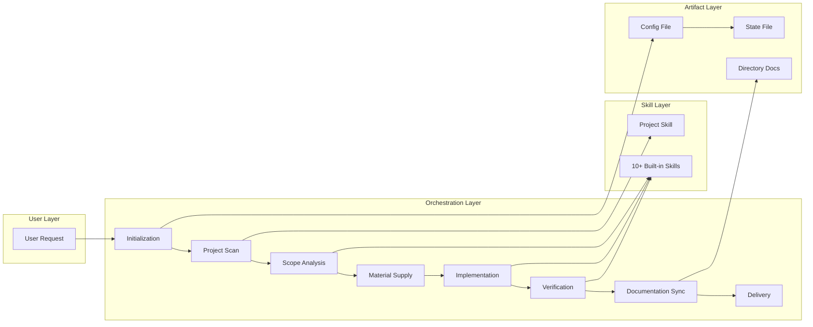
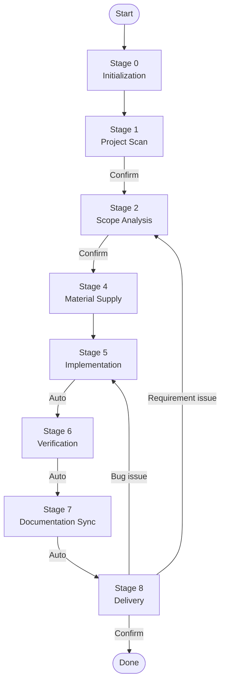

# frontend-workmate

> **Make AI work like a senior engineer**
> 
> **Say goodbye to "trial-and-error" coding, embrace deterministic delivery**

**Full-stack frontend development orchestration skill pack** — A skill-driven task workflow framework that standardizes execution of Bug fixes, Feature implementations, Refactoring, and other frontend development tasks.

**[🇨🇳 返回中文版本 (Back to Chinese Version)](../README.md)**

---

## ✨ What Can It Bring You?

### 🎯 **Deterministic Output**

No more "write some code and see", instead:

```
User Request → Systematic Analysis → Precise Targeting → Verification Loop → Traceable Delivery
```

Every output is verifiable and traceable.

### 🔥 **Root Cause Solutions**

| Your Pain Point | How frontend-workmate Solves It |
| --- | --- |
| 💥 **AI modifies code like "gambling"** — uncertain if it will break | ✅ **9-phase mandatory gates** — every step must produce verifiable artifacts, can't skip |
| 💥 **Bugs come back one after another** — today's fix reappears tomorrow | ✅ **Root-cause-driven debugging** — won't touch code until finding the real source |
| 💥 **Re-explain project every conversation** — exhausting like teaching new employees | ✅ **Project skill auto-generation** — one scan, long-term memory, no repetition needed |
| 💥 **Deliver without verification** — issues found only at production | ✅ **Stage 5→6→7 auto-loop** — auto-verify, auto-sync docs after code changes |
| 💥 **AI gets lost after "fix it"** — feedback leads nowhere | ✅ **Smart fallback positioning** — understands your intent, auto-returns to correct phase |

### 🚀 **Core Capability Matrix**

| Capability Layer | Built-in Skills | Value |
| --- | --- | --- |
| **Project Understanding** | `fw-project-develop` | One-time scan of project structure, tech stack, build method → long-term reusable project memory |
| **Debugging Methodology** | `fw-systematic-debugging` | No intuitive code changes → find root cause first, then precise fix, never "symptom-only" |
| **Best Practices** | `fw-react-best-practices` / `fw-react-components` | React development with rules → 40+ constraint rules, avoid "works but problematic" code |
| **Quality Assurance** | `fw-accessibility` / `fw-web-design-guidelines` | Auto-check after page changes → accessibility + UI guidelines dual verification |
| **Complex Tasks** | `fw-task-plan-checkpoint` | Long tasks never fear interruption → plan-execute-writeback integration, resume anytime |

### 💡 **One-Line Summary**

> **This is not a "write code for you" tool, this is a "make AI follow rules, respect process, take responsibility" development governance system.**

## Core Architecture



## Quick Start

### 1. Install

```bash
# Global install (recommended)
git clone https://github.com/your-org/frontend-workmate.git
mkdir -p ~/ide-config-dir/skills && cp -r frontend-workmate ~/ide-config-dir/skills/
# Example: mkdir -p ~/.trae/skills or mkdir -p ~/.cursor/skills

# Or in-project install
mkdir -p your-project/ide-config-dir/skills
cp -r frontend-workmate your-project/ide-config-dir/skills/
# Example: mkdir -p your-project/.trae/skills or mkdir -p your-project/.cursor/skills
```

### 2. Initialize

```bash
cd your-project
node ide-config-dir/skills/frontend-workmate/scripts/init-skills.js --ide .trae
# Example: node .trae/skills/frontend-workmate/scripts/init-skills.js --ide .trae
# Or: node .cursor/skills/frontend-workmate/scripts/init-skills.js --ide .cursor
```

### 3. Use

Send a request in your AI IDE:

```
Fix the form validation issue on the login page
```

The skill will automatically execute the complete workflow and wait for your feedback at each confirmation point.

## Design Philosophy

### Three Core Directories

Config file only stores **3 paths**, others via concatenation:

```
project_work_dir    → User project root directory (development change reference)
project_ide_dir     → Project IDE config directory (stores config, skills, rules, state)
static_config_dir   → Static config root directory (stores static skills, static rules)
```

**Benefits**:
- Global install and in-project install use same logic
- Config is minimal, runtime dynamic calculation
- Skill reference paths unified

### Development Loop (Stage 5→6→7→8)

Core design: **Stage 5-7 auto-link, Stage 8 waits for user confirmation**

```
Implementation → [auto] → Verification → [auto] → Documentation Sync → [auto] → Delivery → [wait for confirmation]
```

**Why this design?**
- Code modifications must be verified immediately, avoid omissions
- Documentation sync follows verification, ensures artifact consistency
- Delivery confirmation as sole user feedback entry point, smart fallback

### Smart Fallback

Auto-determine fallback phase based on user feedback content:

| Feedback Type | Fallback Phase | Description |
| --- | --- | --- |
| "Login button click not responding" | Stage 5 | Bug issue → back to Implementation |
| "Need to change this requirement" | Stage 2 | Requirement issue → back to Scope Analysis |
| "Go to step 5" | User specified | Explicit instruction → direct jump |

## Workflow Details



| Phase | Key Actions | User Interaction |
| --- | --- | --- |
| Stage 0 | Init config, generate task ID | None |
| Stage 1 | Scan project, generate `fw-project-develop` | **Wait for confirmation** |
| Stage 2 | Analyze task type, plan skill routing | **Wait for confirmation** |
| Stage 3 | Long task breakdown (optional) | None |
| Stage 4 | Collect prerequisite materials | Wait for user to provide |
| Stage 5 | Execute code modifications, invoke skills | None |
| Stage 6 | lint/type/build/functional verification | None |
| Stage 7 | Update project skill, generate directory docs | None |
| Stage 8 | Output delivery results | **Wait for confirmation** |

## Built-in Skills List

| Skill Name | Purpose | Invocation Timing |
| --- | --- | --- |
| `fw-project-develop` | Project skill (Stage 1 generated) | Stage 2/5/6 must invoke |
| `fw-react-best-practices` | React best practices | React tech stack development |
| `fw-react-components` | React component standards | Component development |
| `fw-systematic-debugging` | Systematic debugging | Bug fixes |
| `fw-typescript-advanced-types` | TypeScript advanced types | Complex type problems |
| `fw-accessibility` | WCAG accessibility | Page/component change verification |
| `fw-web-design-guidelines` | UI guidelines | Style/UI change verification |
| `fw-code-analysis-doc` | Code analysis documentation | Directory relationship analysis |
| `fw-task-plan-checkpoint` | Long task checkpoint resume | Multi-step tasks |

## 9 Phases Explanation

### Stage 0: Initialization

- Execute `init-skills.js` initialization script
- Generate task ID
- Create config file and state file

### Stage 1: Project Scan

- Scan project structure, tech stack, build method
- Generate project skill `fw-project-develop`
- **Wait for user confirmation**

### Stage 2: Scope Analysis

- Analyze task type (bug/feature/refactor)
- Determine modification scope and risk points
- Plan skill invocation routing
- **Wait for user confirmation**

### Stage 3: Execution Plan

- Determine if long task breakdown needed
- Skip when conditions met

### Stage 4: Material Supply

- Collect prerequisite materials (API docs, design specs, etc.)
- Wait for user to provide or skip

### Stage 5: Implementation

- Execute code modifications
- Invoke related skills
- **Automatically proceed to Stage 6**

### Stage 6: Verification

- Execute lint/type/build/test
- Functional verification
- **Automatically proceed to Stage 7**

### Stage 7: Documentation Sync

- Update project skill (if new long-term knowledge added)
- Generate directory documentation
- **Automatically proceed to Stage 8**

### Stage 8: Delivery

- Output delivery results
- **Wait for user confirmation**
- Smart fallback based on feedback

## Smart Fallback Rules

| User Feedback Type | Fallback Phase |
| --- | --- |
| Bug/implementation issue | Stage 5 → auto execute 5→6→7→8 |
| Requirement issue | Stage 2 |
| Material supplement | Stage 4 |
| Explicit step specified | User-specified phase |

## Usage Examples

### Bug Fix

```
User: Fix the form validation issue on the login page

Skill:
  [Initialization] Task ID: task_abc123
  [Project Scan] Generated fw-project-develop
  [Scope Analysis] Task type: bug, modification scope: src/pages/Login.tsx
  [Implementation] Invoked fw-systematic-debugging to find root cause
  [Verification] Executed lint/type/build, functional verification passed
  [Documentation Sync] No need to update project skill
  [Delivery] Form validation logic fixed...
```

### Feature Implementation

```
User: Add user management module

Skill:
  [Initialization] Task ID: task_def456
  [Project Scan] fw-project-develop exists
  [Scope Analysis] Task type: feature, involves: src/pages/User/
  [Material Supply] Waiting for API documentation...
  [Implementation] Invoked fw-react-best-practices
  [Verification] Functional verification passed
  [Documentation Sync] Updated src/pages/User/README.md
  [Delivery] User management module implemented...
```

## Config File Location

Config file `.fw-session-config.json` stored in `{project_ide_dir}`:

```
your-project/ide-config-dir/.fw-session-config.json
# Example: your-project/.trae/.fw-session-config.json
# Or: your-project/.cursor/.fw-session-config.json
```

## Development and Extension

### Add New Skill

1. Create skill directory: `skills/curated/your-skill/`
2. Create `SKILL.md` file (YAML frontmatter must contain `name`, `description`)
3. Run `init-skills.js` to sync skills

### Customize Phases

Modify `stages/*.md` files to define phase behavior.

### Customize Rules

Modify `rules/*.md` files to define process rules.

## License

MIT

## Contributing Guide

Issues and Pull Requests welcome.

1. Fork this repository
2. Create feature branch (`git checkout -b feature/amazing-feature`)
3. Commit changes (`git commit -m 'Add amazing feature'`)
4. Push to branch (`git push origin feature/amazing-feature`)
5. Create Pull Request

---

**[🇨🇳 返回中文版本 (Back to Chinese Version)](../README.md)**