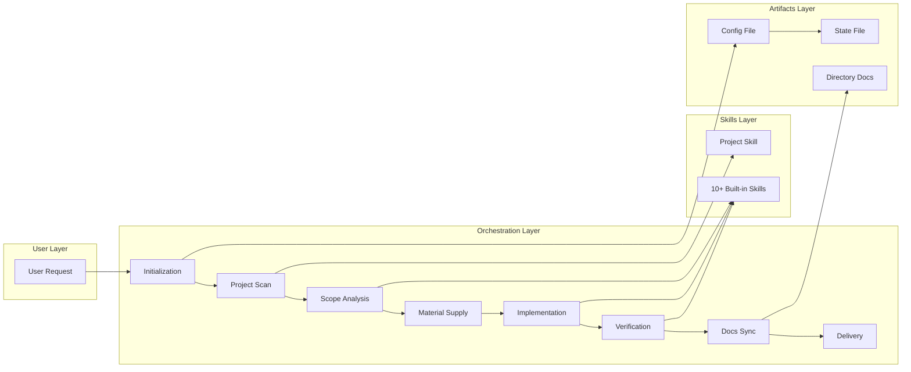
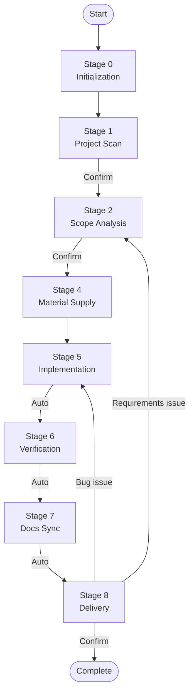

# frontend-workmate

> **Make AI work like a senior engineer**

**Full-stack Frontend Development Orchestration Skill Pack** — A skill-driven task workflow framework that standardizes execution of Bug fixes, Feature implementations, Refactoring, and other frontend development tasks.

**[🇨🇳 返回中文版本 (Back to Chinese Version)](../README.md)**

---

## Why Choose frontend-workmate?

| Problem | frontend-workmate's Solution |
| --- | --- |
| AI modifies code arbitrarily, lacks constraints | 9-phase mandatory gates, every step must produce artifacts |
| Bug fixes treat symptoms not root cause | Systematic debugging skill, find root cause before fixing |
| Lacks project context, repeated questions | Project skill auto-generated, one scan for long-term reuse |
| No verification after changes, quality out of control | Auto-connects Stage 5→6→7, enforces verification loop |
| Don't know where to return after feedback | Smart fallback, auto-locates phase based on feedback type |

## Core Architecture



## Quick Start

### 1. Installation

```bash
# Global install (recommended)
git clone https://github.com/your-org/frontend-workmate.git
mkdir -p ~/ide-config-dir/skills && cp -r frontend-workmate ~/ide-config-dir/skills/
# Example: mkdir -p ~/.trae/skills or mkdir -p ~/.cursor/skills

# Or in-project install
mkdir -p your-project/ide-config-dir/skills
cp -r frontend-workmate your-project/ide-config-dir/skills/
# Example: mkdir -p your-project/.trae/skills or mkdir -p your-project/.cursor/skills
```

### 2. Initialize

```bash
cd your-project
node ide-config-dir/skills/frontend-workmate/scripts/init-skills.js
# Example: node .trae/skills/frontend-workmate/scripts/init-skills.js
# Or: node .cursor/skills/frontend-workmate/scripts/init-skills.js
```

### 3. Usage

Send a request in your AI IDE:

```
Fix the login page form validation issue
```

The skill will automatically execute the full workflow and wait for your feedback at each confirmation point.

## Design Philosophy

### Three Core Directories

The config file only stores **3 paths**, other paths are constructed by concatenation:

```
project_work_dir    → User project root directory (reference for dev changes)
project_ide_dir     → Project IDE config directory (stores config, skills, rules, state)
static_config_dir   → Static resources root directory (stores static skills, static rules)
```

**Advantages**:
- Global install and in-project install use the same logic
- Config is minimal, computed dynamically at runtime
- Skill reference paths are unified

### Development Loop (Stage 5→6→7→8)

Core design: **Stage 5-7 auto-connects, Stage 8 waits for user confirmation**

```
Implementation → [auto] → Verification → [auto] → Docs Sync → [auto] → Delivery → [wait for confirm]
```

**Why designed this way?**
- Code changes must be verified immediately to avoid missing issues
- Docs sync follows verification to ensure artifact consistency
- Delivery confirmation serves as the only user feedback entry point with smart fallback

### Smart Fallback

Automatically determines fallback phase based on user feedback:

| Feedback Type | Fallback Phase | Description |
| --- | --- | --- |
| "Login button has no response" | Stage 5 | Bug issue → return to Implementation |
| "Need to change this requirement" | Stage 2 | Requirements issue → return to Scope Analysis |
| "Go to step 5" | User-specified | Explicit instruction → jump directly |

## Workflow Details



| Stage | Key Actions | User Interaction |
| --- | --- | --- |
| Stage 0 | Initialize config, generate Task ID | None |
| Stage 1 | Scan project, generate `fw-project-develop` | **Wait for confirmation** |
| Stage 2 | Analyze task type, plan skill route | **Wait for confirmation** |
| Stage 3 | Long task breakdown (optional) | None |
| Stage 4 | Collect prerequisite materials | Wait for user to provide |
| Stage 5 | Execute code changes, invoke skills | None |
| Stage 6 | lint/type/build/functional verification | None |
| Stage 7 | Update project skill, generate directory docs | None |
| Stage 8 | Output delivery results | **Wait for confirmation** |

## Built-in Skills

| Skill Name | Purpose | Invocation Timing |
| --- | --- | --- |
| `fw-project-develop` | Project skill (generated in Stage 1) | Must invoke in Stage 2/5/6 |
| `fw-react-best-practices` | React best practices | React tech stack development |
| `fw-react-components` | React component standards | Component development |
| `fw-systematic-debugging` | Systematic debugging | Bug fixing |
| `fw-typescript-advanced-types` | TypeScript advanced types | Complex type issues |
| `fw-accessibility` | WCAG accessibility | Page/component change verification |
| `fw-web-design-guidelines` | UI guidelines | Style/UI change verification |
| `fw-code-analysis-doc` | Code analysis documentation | Directory relationship analysis |
| `fw-task-plan-checkpoint` | Long task checkpoint resume | Multi-step tasks |

## 9-Stage Overview

### Stage 0: Initialization

- Execute `init-skills.js` init script (auto-detects project root)
- Generate Task ID
- Create config file and state file

### Stage 1: Project Scan

- Scan project structure, tech stack, build method
- Generate project skill `fw-project-develop`
- **Wait for user confirmation**

### Stage 2: Scope Analysis

- Analyze task type (bug/feature/refactor)
- Determine modification scope and risk points
- Plan skill invocation route
- **Wait for user confirmation**

### Stage 3: Execution Plan

- Determine if long task breakdown is needed
- Skip when conditions are met

### Stage 4: Material Supply

- Collect prerequisite materials (API docs, design specs, etc.)
- Wait for user to provide or skip

### Stage 5: Implementation

- Execute code modifications
- Invoke relevant skills
- **Auto-proceed to Stage 6**

### Stage 6: Verification

- Execute lint/type/build/test
- Functional verification
- **Auto-proceed to Stage 7**

### Stage 7: Documentation Sync

- Update project skill (if new long-term knowledge added)
- Generate directory documentation
- **Auto-proceed to Stage 8**

### Stage 8: Delivery

- Output delivery results
- **Wait for user confirmation**
- Smart fallback based on feedback

## Smart Fallback Rules

| User Feedback Type | Fallback Phase |
| --- | --- |
| Bug/implementation issues | Stage 5 → auto execute 5→6→7→8 |
| Requirements issues | Stage 2 |
| Material supplement | Stage 4 |
| Explicitly specified step | User-specified phase |

## Usage Examples

### Bug Fix

```
User: Fix the login page form validation issue

Skill:
  [Initialization] Task ID: task_abc123
  [Project Scan] Generated fw-project-develop
  [Scope Analysis] Task type: bug, scope: src/pages/Login.tsx
  [Implementation] Invoked fw-systematic-debugging to find root cause
  [Verification] Executed lint/type/build, functional verification passed
  [Docs Sync] No project skill update needed
  [Delivery] Form validation logic has been fixed...
```

### Feature Implementation

```
User: Add user management module

Skill:
  [Initialization] Task ID: task_def456
  [Project Scan] fw-project-develop already exists
  [Scope Analysis] Task type: feature, involves: src/pages/User/
  [Material Supply] Waiting for API documentation...
  [Implementation] Invoked fw-react-best-practices
  [Verification] Functional verification passed
  [Docs Sync] Updated src/pages/User/README.md
  [Delivery] User management module has been implemented...
```

## Config File Location

Config file `.fw-session-config.json` is stored in `{project_ide_dir}`:

```
your-project/ide-config-dir/.fw-session-config.json
# Example: your-project/.trae/.fw-session-config.json
# Or: your-project/.cursor/.fw-session-config.json
```

## Development & Extension

### Adding New Skills

1. Create skill directory: `skills/curated/your-skill/`
2. Create `SKILL.md` file (YAML frontmatter must contain `name`, `description`)
3. Run `init-skills.js` to sync skills

### Customizing Phases

Modify `stages/*.md` files to define phase behavior.

### Customizing Rules

Modify `rules/*.md` files to define workflow rules.

## License

MIT

## Contributing

Issues and Pull Requests are welcome.

1. Fork this repository
2. Create a feature branch (`git checkout -b feature/amazing-feature`)
3. Commit your changes (`git commit -m 'Add amazing feature'`)
4. Push to the branch (`git push origin feature/amazing-feature`)
5. Create a Pull Request
